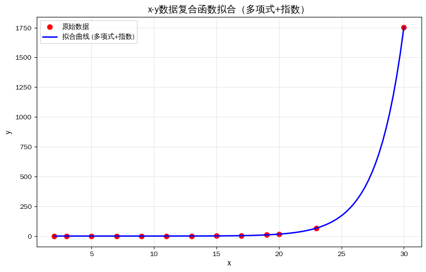

# Shell实现计划书: 详细实施计划

---

## 目录

- [Shell实现计划书: 详细实施计划](#shell实现计划书-详细实施计划)
  - [目录](#目录)
  - [基于概念设计的实现路径](#基于概念设计的实现路径)
  - [第一部分: 核心架构概览](#第一部分-核心架构概览)
    - [1.1 整体架构分层](#11-整体架构分层)
    - [1.2 模块依赖关系](#12-模块依赖关系)
  - [第二部分: 公共类型系统](#第二部分-公共类型系统)
    - [2.1 核心类型定义](#21-核心类型定义)
    - [2.2 接口契约](#22-接口契约)
  - [第三部分: 前端实现](#第三部分-前端实现)
    - [3.1 词法分析器](#31-词法分析器)
    - [3.2 语法分析器](#32-语法分析器)
    - [3.3 特殊内置命令的语法支持](#33-特殊内置命令的语法支持)
  - [第四部分: 中间表示生成](#第四部分-中间表示生成)
    - [4.1 从语法树到中间表示](#41-从语法树到中间表示)
    - [4.2 变量访问的转换](#42-变量访问的转换)
    - [4.3 命令替换的名称修饰](#43-命令替换的名称修饰)
      - [4.3.1 名称修饰的做法](#431-名称修饰的做法)
      - [4.3.2 为什么要砍掉子进程/子shell](#432-为什么要砍掉子进程子shell)
      - [4.3.3 如何保证子进程语义不变的同时不污染父环境](#433-如何保证子进程语义不变的同时不污染父环境)
      - [4.3.4 信号总线](#434-信号总线)
    - [4.4 算术表达式的处理](#44-算术表达式的处理)
    - [4.5 单词分割的控制](#45-单词分割的控制)
    - [4.6 特殊内置命令的关键字化处理](#46-特殊内置命令的关键字化处理)
      - [4.6.1 部分专用 IR 指令映射示例](#461-部分专用-ir-指令映射示例)
      - [4.6.2 设计意图](#462-设计意图)
      - [4.6.3 示例说明](#463-示例说明)
    - [4.7 中间表示的降级](#47-中间表示的降级)
      - [4.7.1 为什么需要降级中间表示](#471-为什么需要降级中间表示)
      - [4.7.2 我们需要怎样的降级中间表示?](#472-我们需要怎样的降级中间表示)
  - [第五部分: 优化器设计](#第五部分-优化器设计)
    - [5.1 优化框架](#51-优化框架)
    - [5.2 必须实现的优化](#52-必须实现的优化)
    - [5.3 优化时机](#53-优化时机)
    - [5.4 优化过程](#54-优化过程)
  - [第六部分: 虚拟机设计](#第六部分-虚拟机设计)
    - [6.1 虚拟机架构](#61-虚拟机架构)
    - [6.2 指令分派](#62-指令分派)
    - [6.3 资源管理](#63-资源管理)
    - [6.4 信号处理](#64-信号处理)
    - [6.5 作业控制](#65-作业控制)
  - [第七部分: 平台抽象层](#第七部分-平台抽象层)
    - [7.1 抽象层职责](#71-抽象层职责)
    - [7.2 进程管理的统一接口](#72-进程管理的统一接口)
    - [7.3 信号模拟策略](#73-信号模拟策略)
    - [7.4 文件描述符模拟](#74-文件描述符模拟)
  - [第八部分: 运行时组件](#第八部分-运行时组件)
    - [8.1 变量管理器](#81-变量管理器)
    - [8.3 路径查找表](#83-路径查找表)
    - [8.4 中间表示缓存](#84-中间表示缓存)
  - [第九部分: 变量存储的多表设计](#第九部分-变量存储的多表设计)
    - [9.1 表分离的核心思想](#91-表分离的核心思想)
    - [9.2 变量操作的 IR 指令](#92-变量操作的-ir-指令)
      - [9.2.1 普通赋值](#921-普通赋值)
      - [9.2.2 带导出的赋值](#922-带导出的赋值)
      - [9.2.3 单独导出](#923-单独导出)
      - [9.2.4 只读赋值](#924-只读赋值)
      - [9.2.5 变量读取](#925-变量读取)
      - [9.2.6 变量删除](#926-变量删除)
    - [9.3 子进程环境构建](#93-子进程环境构建)
    - [9.4 只读检查机制](#94-只读检查机制)
    - [9.5 设计优势](#95-设计优势)
  - [第十部分: 错误处理体系](#第十部分-错误处理体系)
    - [10.1 错误的三层结构](#101-错误的三层结构)
    - [10.2 编译期错误的处理](#102-编译期错误的处理)
    - [10.3 运行时错误的处理](#103-运行时错误的处理)
    - [10.4 退出状态维护](#104-退出状态维护)
  - [第十一部分: 启动与退出流程](#第十一部分-启动与退出流程)
    - [11.1 启动流程](#111-启动流程)
    - [11.2 交互式主循环](#112-交互式主循环)
    - [11.3 退出流程](#113-退出流程)
  - [第十二章: 开发顺序建议](#第十二章-开发顺序建议)
    - [12.1 第一阶段: 核心基础设施](#121-第一阶段-核心基础设施)
    - [12.2 第二阶段: 简单命令执行](#122-第二阶段-简单命令执行)
    - [12.3 第三阶段: 展开与引用](#123-第三阶段-展开与引用)
    - [12.4 第四阶段: 复合命令与控制流](#124-第四阶段-复合命令与控制流)
    - [12.5 第五阶段: 作业控制与信号](#125-第五阶段-作业控制与信号)
    - [12.6 第六阶段: 优化器](#126-第六阶段-优化器)
    - [12.7 第七阶段: 缓存与性能](#127-第七阶段-缓存与性能)
    - [12.8 持续集成: 测试贯穿始终](#128-持续集成-测试贯穿始终)
  - [第十三章: 概念完整性回顾](#第十三章-概念完整性回顾)
    - [13.1 设计哲学的实现](#131-设计哲学的实现)
    - [13.2 关键创新点的实现](#132-关键创新点的实现)
    - [13.3 最终目标](#133-最终目标)

---
## 基于概念设计的实现路径

## 第一部分: 核心架构概览

### 1.1 整体架构分层

我们的 shell 采用清晰的分层架构, 每一层都有明确的职责边界: 

```
+-------------------+
|    前端层         | 词法分析、语法分析、别名展开
+-------------------+
|    中端层         | IR生成、SSA转换、优化
+-------------------+
|    后端层         | 虚拟机执行、平台抽象
+-------------------+
|    运行时层       | 变量管理、作业控制、内置命令
+-------------------+
```

### 1.2 模块依赖关系

模块间采用接口隔离原则, 核心类型定义在公共模块中, 各模块通过实现特定接口来交互: 

- **公共类型模块**: 定义所有模块共享的核心类型和接口契约
- **前端模块**: 依赖公共类型, 产生语法树
- **中端模块**: 依赖公共类型和前端产物, 产生中间表示
- **后端模块**: 依赖公共类型和中端产物, 执行程序
- **运行时模块**: 被后端模块调用, 提供运行时服务

---

## 第二部分: 公共类型系统

### 2.1 核心类型定义

公共类型模块提供以下核心概念的定义: 

**词法单元类型**: 描述源代码的基本组成单元, 包括关键字、操作符、字面量、标识符等. 每种词法单元都携带必要的位置信息, 用于错误报告. 

**语法树节点类型**: 描述程序的语法结构, 包括简单命令、管道、复合命令 (if、while、for、case) 、函数定义等. 语法树保留源代码的原始结构, 不进行任何展开. 

**中间表示指令类型**: 描述程序的底层操作, 包括控制流指令、数据操作指令、展开指令、资源声明指令、执行指令等. 指令采用静态单赋值形式, 每个值只定义一次. 

**值类型**: 描述运行时值的可能形态, 包括字符串、整数、浮点数、数组等. 值类型支持自动类型推断和转换. 

**错误类型**: 按三层结构组织——编译期错误、运行时错误、组件内部错误. 每类错误都有明确的产生时机和处理方式. 

### 2.2 接口契约

公共类型模块定义以下关键接口: 

**可展开接口**: 所有需要在运行时展开的语法元素都实现此接口, 规定展开的时机和方式. 

**可优化接口**: 所有支持编译期优化的中间表示指令都实现此接口, 提供常量传播、死代码消除等优化能力. 

**可执行接口**: 所有可以在虚拟机中执行的指令都实现此接口, 规定执行时的行为. 

**资源生命周期接口**: 所有操作系统资源 (管道、文件、进程) 都实现此接口, 规定创建、使用、销毁的规范. 

---

## 第三部分: 前端实现

### 3.1 词法分析器

词法分析器的职责是将输入的字符流转换为词法单元流. 它需要处理: 

**引用机制**: 识别单引号、双引号、反引号的不同语义, 正确处理引用内的转义字符. 引用不会在词法阶段被删除, 而是作为词法单元的属性保留. 

**注释处理**: 识别以 `#` 开头的注释, 将其完全忽略, 不产生任何词法单元. 

**别名展开**: 在词法分析阶段识别并展开别名. 别名展开可能产生新的词法单元, 这些新单元需要继续参与词法分析. 

**操作符识别**: 识别所有 POSIX 定义的操作符, 包括管道符、逻辑操作符、重定向操作符、后台操作符等. 

### 3.2 语法分析器

语法分析器的职责是将词法单元流转换为抽象语法树. 它需要处理: 

**简单命令**: 由单词和重定向组成的命令, 可能带有前置变量赋值. 语法树中保留命令的原始形式, 不进行任何展开. 

**管道命令**: 由 `|` 连接的多个简单命令. 语法树中管道是一个节点, 包含多个子命令. 

**复合命令**: 包括 `if` 语句、`while` 循环、`for` 循环、`case` 语句、函数定义等. 每种复合命令都有对应的语法树节点, 保留完整的结构信息. 

**命令组合**: 包括 `{}` 包围的命令列表和 `()` 包围的子 shell. 语法树中区分这两种不同的语义. 

### 3.3 特殊内置命令的语法支持

全部的内置命令在语法层面获得特殊支持: 

**点命令**: `.` 命令在语法分析时被识别, 其参数作为文件路径处理, 后续会触发新的编译过程.  

**cd 与 pwd**: `cd` 命令在语法分析时被识别, 其生成特殊的IR节点并控制`pwd`展示的行为  

**冒号命令**: `:` 命令在语法分析时被识别, 生成特殊的空操作节点. 

**break 和 continue**: 在语法分析时检查它们是否出现在合法的上下文中 (循环体内) , 如果不在循环中则产生编译期错误. 

**trap 命令**: 其命令参数在语法分析时被保留为字符串, 但在 IR 生成阶段会被提前编译为中间表示, 缓存在专门的信号处理表中. 

所有的内置命令均为特殊的IR组合, 还有部分内置命令需要特殊处理, 此处不赘述.

---

## 第四部分: 中间表示生成

### 4.1 从语法树到中间表示

IR 生成器遍历语法树, 为每个语法结构生成对应的中间表示指令. 这个过程遵循以下原则: 

**静态单赋值形式**: 每个值只定义一次, 控制流合并点使用 φ 函数合并不同路径的值. 变量值在寄存器中流动, 只有需要持久化时才存储到变量表. 

**展开的显式化**: 所有 POSIX 定义的展开阶段都转换为显式的 IR 指令. 每个展开指令都有明确的输入和输出, 展开顺序由指令顺序保证. 

**声明的集中化**: 管道、进程模板、作业组等资源在 IR 中先声明后使用. 声明指令只创建资源的描述符, 不产生实际系统调用. 

### 4.2 变量访问的转换

变量访问根据上下文转换为不同的 IR 指令: 

**普通变量访问**: 转换为 `LOAD_VAR` 指令, 从当前作用域查找变量. 查找规则是: 先查当前展开域 (如命令替换内部) , 再逐级向上查, 直到全局作用域. 

**变量赋值**: 转换为 `STORE_VAR` 指令, 将寄存器的值存储到变量表中. 赋值的同时可能触发类型推断, 将字符串转换为数值类型. 

**特殊参数访问**: `$?`、`$$`、`$!`、`$#`、`$@`、`$*` 等转换为专门的 `LOAD_SPECIAL` 指令, 从运行时状态直接读取. 

**位置参数访问**: `$1`、`$2` 等转换为带索引的 `LOAD_POSITIONAL` 指令, 从函数参数列表或脚本参数列表读取. 

### 4.3 命令替换的名称修饰

#### 4.3.1 名称修饰的做法

命令替换采用名称修饰策略实现变量隔离:

每个命令替换在 IR 生成时被分配一个唯一的顺序索引. 当命令替换内部访问变量时, 生成的 `LOAD_VAR` 指令首先尝试查找 `tmp_{area_index}_{varname}`, 如果找不到则冒泡回父级查找, 直到 `main_{varname}`.

这种机制无需创建子进程或子 shell, 就能实现命令替换的语义隔离, 同时保持高效的变量访问.

#### 4.3.2 为什么要砍掉子进程/子shell

以下是传统shell: bash 在执行 fib 30时的实测数据:

```plaintext
real    29m13.402s
user    15m2.433s
sys     4m0.390s
```

以下是其它n值时bash的用时和依据数据拟合出的曲线:

```plaintext
x: 2, 3, 5, 7, 9, 11, 13, 15, 17, 19, 20, 23, 30
y: 0.001, 0.003, 0.009, 0.024, 0.061, 0.162, 0.410, 1.087, 3.912, 10.042, 15.913, 66.696, 1753.402
```

拟合曲线:

```plaintext
y = -0.00252573x² + 0.01825384x - 0.02816013 + 0.00152539 × e^(0.46519387x)
```



上述过程用到的fib函数:

```shell
fib() {
    local n=$1
    if [ "$n" -eq 0 ]; then
        echo 0
    elif [ "$n" -eq 1 ]; then
        echo 1
    else
        echo $(( $(fib $((n-1))) + $(fib $((n-2))) ))
    fi
}
```

根据拟合函数, 当bash计算fib40的用时来到了恐怖的183915.461秒, 也就是大于两天, 这充分说明了传统shell的fork所带来的严重开销

#### 4.3.3 如何保证子进程语义不变的同时不污染父环境

方案一: 编译期对子shell/子进程语法上进行分析, 得到会改变进程状态的参数, 如`set -x`、`cd`等, 之后在子进程结束时插入相反操作的IR即可.

方案二: 部分内置命令会进行特殊处理, 进行作用域限制所以不需要进行相反IR.

对于真实的二进制程序, 我们继续使用 fork.

由于这部分内容已超出本文档的范围, 且篇幅可预见的会较长, [此处按下不表](POSIX23个必选信号（Windows兼容版）.md).

#### 4.3.4 信号总线

RDP放弃了绝大部分的子进程、子Shell

(除了需要调用外部程序的情况, 以及管道一侧出现外部程序的情况, 这部分的fork是没有办法避免的), 

那么如何处理信号? 本架构借鉴前端开发的发布-订阅模式 (事件总线) 实现信号处理, 

变量处理则采用直接的名称修饰方式, 核心设计细节如下: 

1. 事件传递机制
- 整体基于统一的事件总线 (bus) 实现事件管理与传递. 
- 为每个作用域在统一事件总线中分配独立的事件表, 实现作用域级别的事件隔离与管理. 
- 采用协程机制监听总线中的事件, 并负责事件的分发与传递处理. 
2. 信号处理规则
- 信号处理全程无需对主信号仓库进行拷贝操作, 减少资源开销与数据一致性问题. 
- 内部信号触发时, 优先在当前作用域的事件表中查找对应的信号处理器. 
- 若当前作用域未找到匹配的处理器, 自动向上调用父作用域的处理器, 依次递归查找. 
- 查找过程持续至找到匹配的处理器, 或遍历冒泡至顶级作用域仍无注册处理器时终止. 

上述信号处理的作用域递归查找逻辑, 称为RDP Scope Prototype Chain, RSPC.

### 4.4 算术表达式的处理

算术展开 `$(( ))` 中的表达式在 IR 生成阶段被分析: 

如果表达式中所有操作数都是编译期常量 (数字字面量或已赋值为常量的变量) , 则在编译期直接计算结果, 生成静态指令. 

如果表达式中包含动态变量, 则生成对应的算术运算指令 (加法、减法、乘法、除法、取模、位运算等) , 这些指令在运行时根据变量的实际值进行计算. 

类型检查在编译期尽可能进行: 如果发现对字符串常量进行算术运算, 直接产生编译期错误. 对于动态变量, 类型检查推迟到运行时. 

### 4.5 单词分割的控制

单词分割指令 `SPLIT_WORDS` 的生成受上下文控制: 

如果单词在源代码中被引号包围 (单引号或双引号) , 则不生成分割指令, 保留单词的原始形式. 

如果单词未被引号包围, 则生成分割指令, 该指令在运行时根据 IFS 变量的值将字符串分割为多个单词, 结果以数组形式返回. 

### 4.6 特殊内置命令的关键字化处理

POSIX 定义的特殊内置命令 (`:`、`.`、`break`、`continue`、`eval`、`exec`、`export`、`readonly`、`shift`、`trap`、`unset`) 等全部的内置命令在语法分析阶段被识别为关键字, 而不是普通命令名. 它们在中间表示中有对应的专用指令, 不经过任何命令查找或内置函数调用过程. 

#### 4.6.1 部分专用 IR 指令映射示例

| 特殊内置       | IR 指令          | 语义说明                      |
| ---------- | -------------- | ------------------------- |
| `:`        | `NOP`          | 空操作指令, 总是返回成功 (退出状态 0)    |
| `.`        | `INCLUDE_FILE` | 读取指定文件, 将其内容插入当前位置执行      |
| `break`    | `BREAK`        | 跳出当前循环, 可选操作数指定跳出层数       |
| `continue` | `CONTINUE`     | 跳过当前循环迭代, 进入下一次迭代         |
| `cd`       |`CHDIR_L`/`CHDIR_P`| 依据互斥参数(L/P)生成修改工作目录的字节码并控制pwd的行为         |
| `eval`     | `EVAL`         | 将参数拼接为字符串, 重新进入编译执行流程     |
| `exec`     | `EXEC`         | 替换当前 shell 进程或修改重定向       |
| `export`   | `INSERT`指令组  | 将变量名加入导出表, 可选同时赋值         |
| `readonly` | `READONLY`     | 将变量名加入只读表, 可选同时赋值         |
| `shift`    | `SHIFT`        | 左移位置参数, 可选操作数指定移动位数       |
| `trap`     | `TRAP`         | 注册信号处理程序, 命令参数预编译为 IR 并缓存 |
| `unset`    | `UNSET`        | 从各表中删除变量或函数               |

其余 IR 详细设计有专用文档, 此处仅做基础描述, 不再赘述.

#### 4.6.2 设计意图

将全部的内置命令作为关键字处理, 而非运行时查找的内置函数, 带来了以下优势: 

**编译期检查**: 可以在 IR 生成阶段发现错误, 如 `break` 不在循环中、`shift` 参数超出范围 (如果参数是常量) 、`export` 后跟非法变量名等. 

**精确控制**: `BREAK` 指令可以直接编码要跳出的循环层数, 虚拟机执行时无需运行时查找循环上下文. 

**效率提升**: 无需维护内置命令表、无需参数解析、无需函数调用开销. 

**语义清晰**: 每个特殊内置的语义直接体现在 IR 指令中, 没有隐含的运行时行为.

**符合架构**: 所有的内置命令都是 IR 指令, 为名称修饰和作用域管理带来足够的便利

#### 4.6.3 示例说明

**break 多层循环**: 

```bash
while true; do
    while true; do
        break 2
    done
done
```

IR 生成: 

```
BREAK 2   ; 直接编码跳出两层循环
```

**export 赋值**: 

```bash
export x=5
```

IR 生成: 

```
%1 = CONST 5
SAVE "x", %1, NORMAL_TABLE    ; 存入普通变量表
INSERT "x", EXPORT_TABLE       ; 将变量名加入导出表
```

**trap 注册**: 

```bash
trap 'echo interrupted' INT
```

处理流程: 

1. 编译 `echo interrupted` 得到 IR 序列
2. 生成 `TRAP` 指令, 将信号 INT 与编译后的 IR 关联
3. 信号到达时进入信号管线冒泡查找处理器

### 4.7 中间表示的降级

#### 4.7.1 为什么需要降级中间表示

SSA 字节码是寄存器式字节码, 它以单次静态赋值著称, 每条指令都要显式的写出操作数地址, 指令更长、密度低、操作复杂, 解释器要管理无限寄存器, 远不如栈式简单, 且效率低下、代码臃肿.

#### 4.7.2 我们需要怎样的降级中间表示?

我们以栈式字节码+内置原语作为降级后的字节码, 将纯逻辑部分如计算、变量等降级为栈式字节码, 同时保留内置原语进行如管道创建、任务调度等操作, 降级后的字节码直接交给 VM 进行解释执行

---

## 第五部分: 优化器设计

### 5.1 优化框架

优化器以中间表示为输入, 经过一系列等价变换, 输出更高效的中间表示. 所有优化都保持语义不变性, 确保优化后的程序行为与原始程序完全一致. 

优化器采用 pass 管道架构, 每个 pass 实现一种特定的优化技术, 可以按顺序组合执行. 

### 5.2 必须实现的优化

**死代码消除**: 删除永远不会执行的代码, 如条件恒假的分支、不可达的基本块、无用的赋值 (变量后续未被使用) . 这需要数据流分析来确定代码的有效性. 

**常量传播与折叠**: 将常量值沿数据流传播, 在编译期计算常量表达式的结果. 例如, `x=5; y=$x+3` 可以优化为 `y=8`. 

**公共子表达式消除**: 识别重复计算相同值的表达式, 将后续计算替换为第一次计算的结果. 这需要分析表达式的等价性. 

**循环不变代码外提**: 将循环体内不随迭代变化的计算移到循环外部, 避免重复计算. 这需要识别循环不变量的能力. 

**部分冗余消除**: 消除在部分执行路径上重复出现的表达式, 通过在合适的位置插入计算来减少重复. 

**全局值编号**: 为程序中的每个值分配唯一的编号, 识别出计算相同值的不同表达式, 便于后续优化. 

**强度减弱**: 将昂贵的运算替换为等价的廉价运算, 例如将乘法 `i*2` 替换为左移 `i<<1`, 将循环中的乘法替换为加法. 

**指令重排**: 在不改变语义的前提下重新排列指令顺序, 以提高指令级并行性, 减少流水线停顿. 

**递归优化**: 识别尾递归调用, 将其转换为循环, 避免栈溢出并提高性能. 同时支持函数内联, 将小函数的调用替换为函数体本身. 

### 5.3 优化时机

优化可以在多个阶段进行: 

**IR 生成后立即优化**: 对刚生成的 IR 应用基本优化, 消除明显的冗余. 

**跨基本块优化**: 在控制流图构建完成后, 进行全局数据流分析, 应用需要全局信息的优化. 

**多次迭代优化**: 某些优化可能会创造新的优化机会, 因此优化器可以多次迭代应用各种优化 pass, 直到达到稳定状态. 

### 5.4 优化过程

优化可以是按照语义块进行, 如一段条件判断、一个循环、一个函数等基本块

将原始字节码按照语义分割后, 优化器以一定数量并行的对每个语义块同时进行优化

---

## 第六部分: 虚拟机设计

### 6.1 虚拟机架构

虚拟机是中间表示的执行引擎, 它维护以下运行时状态: 

**寄存器文件**: 存储所有虚拟寄存器的当前值. 寄存器数量理论上无限, 实际实现中按需分配. 

**变量表**: 存储所有全局变量的当前值, 以及变量的元数据 (如只读属性、导出属性) . 变量表采用名称修饰策略, 支持展开域的查找规则. 

**特殊值缓存**: 存储频繁访问的特殊值, 如当前进程 ID、上一个命令的退出状态、最近后台进程的 PID 等. 

**资源表**: 存储已声明的操作系统资源, 包括管道、文件描述符、进程模板、作业组等. 每种资源都有唯一的标识符和当前状态. 

**调用栈**: 记录函数调用的嵌套层次, 每个栈帧包含返回地址、局部变量映射、位置参数等必须信息. 

### 6.2 指令分派

虚拟机的主循环是一个简单的指令分派器: 

信号到达时暂停当前指令流向虚拟机的投入, 处理信号(执行 trap 命令或转发给前台作业).

根据指令类型分派到对应的处理函数. 处理函数读取指令的操作数, 从寄存器中获取输入值, 执行操作, 将结果写回目标寄存器. 

指令执行完成后, 更新指令指针, 继续下一条指令. 控制流指令 (条件分支、无条件跳转、函数调用) 会改变指令指针的常规递增顺序. 

虚拟机内部每次仅录入两条字节码, 一条用于执行, 另一条用于排队, 降低空闲时间, 每条指令执行完毕后做一次信号事件处理, 以协作式中断为主, 避免抢占式中断带来的危险性.

### 6.3 资源管理

资源采用两阶段管理: 

**声明阶段**: 资源声明指令 (`CREATE_PIPE`、`SPAWN_DEFINE`、`JOB_CREATE`) 只在资源表中创建资源描述符, 不调用操作系统. 描述符包含创建资源所需的所有信息, 如管道两端、进程模板的属性和连接关系、作业组的进程列表. 

**执行阶段**: 执行指令 (`JOB_START`、`JOB_WAIT`) 基于资源描述符调用平台抽象层, 真正创建操作系统对象. 例如, `JOB_START` 会为作业组中的每个进程模板创建真实进程, 建立管道连接, 设置进程组, 并根据前台/后台属性决定终端控制权. 

资源在使用完毕后需要显式关闭 (`CLOSE` 指令) 或由虚拟机在作业结束时自动清理. 

### 6.4 信号处理

信号处理采用异步安全的设计: 

操作系统信号到达时, 信号处理器只做最少的工作: 设置一个全局的标志, 并通过自醒管道通知主循环. 信号处理器中不执行任何复杂操作, 避免死锁. 

虚拟机主循环在每条指令执行前检查信号标志. 如果发现信号到达, 暂停当前指令流, 进入信号处理流程: 查找该信号对应的 trap 处理程序, 如果有则执行预编译的 IR; 如果是 SIGINT 等终端信号, 则转发给当前前台作业组; 更新 shell 的内部状态 (如被中断的命令的退出状态) . 

信号处理程序本身也是中间表示, 在 `trap` 命令注册时就已经编译完成并缓存, 因此信号处理时无需重新编译, 直接执行即可. 

### 6.5 作业控制

**jobs 命令**: 查询虚拟机中的作业组状态表, 显示所有活动作业的信息 (作业 ID、状态、命令行) . 

**fg 命令**: 将指定作业组切换到前台. 这涉及将作业组所在进程组设置为终端的前台进程组, 恢复进程组中所有进程的运行 (如果之前被停止) , 然后等待该作业组结束. 

**bg 命令**: 将指定作业组切换到后台. 如果作业组处于停止状态, 向其发送 SIGCONT 信号使其继续运行. 

**作业状态跟踪**: 虚拟机维护所有活动作业组的状态, 包括运行、停止、已完成等状态. 当子进程状态发生变化时 (通过 waitpid 或等效机制捕获) , 更新对应作业组的状态. 

---

## 第七部分: 平台抽象层

### 7.1 抽象层职责

平台抽象层向上层提供统一的 POSIX 语义接口, 隐藏不同操作系统的实现差异. 它的核心职责包括: 

**进程管理**: 提供统一的进程创建、等待、终止接口, 隐藏 fork+exec 与 CreateProcess 的差异. 

**文件描述符管理**: 提供统一的管道创建、文件打开、描述符复制、描述符关闭接口, 隐藏不同系统调用接口的差异. 

**信号处理**: 提供统一的信号注册、信号屏蔽、信号发送接口. 在缺乏信号概念的平台上 (如 Windows) , 通过控制台事件、异常处理、等待线程等机制模拟信号语义. 

**终端控制**: 提供统一的终端属性获取/设置、前台进程组控制接口. 在不同平台上适配对应的终端或控制台 API. 

注意, 我们做的不是第二个`git-bash`或者`Cygwin`, 我们只需要封装 API 调用以达到表层行为近似 Linux 即可, 不需要完整的模拟一个 Linux 系统, RDP 并不需要提供 Linux 程序的兼容层.

### 7.2 进程管理的统一接口

平台抽象层提供的进程管理接口包括: 

**进程创建**: 接受可执行文件路径、参数列表、环境变量、标准输入/输出/错误的重定向描述, 返回新进程的标识符. 这个接口隐藏了 Unix 的 fork+exec 和 Windows 的 CreateProcess 的差异. 

**进程等待**: 接受进程标识符, 阻塞直到该进程结束, 返回退出状态. 在 Unix 上使用 waitpid, 在 Windows 上使用等待句柄和 GetExitCodeProcess. 

**进程终止**: 向指定进程发送终止信号. 在 Unix 上使用 kill, 在 Windows 上使用 TerminateProcess (模拟 SIGTERM) 或 GenerateConsoleCtrlEvent (模拟 SIGINT) . 

**进程组操作**: 提供设置进程组、将进程组设置为前台等操作. 在 Windows 上, 进程组模拟需要额外的机制, 如创建控制台的新进程组. 

### 7.3 信号模拟策略

在 Windows 平台上, 信号通过以下方式模拟: 

**SIGINT**: 通过 SetConsoleCtrlHandler 捕获 Ctrl+C 和 Ctrl+Break 事件, 将这些事件转换为 SIGINT 信号. 可以模拟发送 SIGINT 到指定进程组. 

**SIGTERM**: 通过 TerminateProcess 实现, 但需要注意 TerminateProcess 是强制终止, 不会给目标进程清理的机会. 这符合 SIGTERM 的语义. 

**SIGCHLD**: 通过为每个子进程创建等待线程, 线程阻塞等待子进程结束, 结束后向主线程发送自定义消息, 模拟 SIGCHLD 的到达. 

**信号屏蔽**: 在 Windows 上, 信号屏蔽可以通过维护每个线程的屏蔽字实现, 但实际效果有限. 采取尽力而为的策略, 在 API 允许的范围内模拟. 

### 7.4 文件描述符模拟

Windows 上需要模拟 Unix 风格的文件描述符语义: 

**管道创建**: 使用 CreatePipe 创建匿名管道, 返回的句柄可以包装为类似文件描述符的整数. 需要处理读写端的正确关闭. 

**描述符复制**: 使用 DuplicateHandle 复制句柄, 模拟 dup2 的语义. 在创建子进程时, 通过设置继承标志和使用 STARTF_USESTDHANDLES 来实现重定向. 

**描述符继承**: 在 Unix 上, 文件描述符默认被子进程继承. 在 Windows 上, 需要显式设置句柄的可继承标志, 并在 CreateProcess 时指定要继承的句柄列表. 

---

## 第八部分: 运行时组件

### 8.1 变量管理器

变量管理器维护所有变量的状态, 提供以下功能: 

**变量存储**: 采用键值对存储, 键为经过名称修饰的变量名 (如 `main_PATH`、`tmp_1_x`) , 值为变量值及其元数据. 变量值可以是字符串或数值, 数值又分为整数和浮点数, 支持自动类型转换. 

**变量查找**: 根据当前展开域的索引, 按照名称修饰规则查找变量. 先查当前域, 再逐级向上查, 直到全局域. 查找过程中考虑只读属性, 禁止对只读变量赋值. 

**变量导出**: 维护导出变量列表, 在创建子进程时, 将这些变量及其值转换为环境变量字符串数组. 

**只读变量**: 标记某些变量为只读, 任何尝试修改只读变量的操作都会产生运行时错误. 

### 8.3 路径查找表

为了优化命令查找性能, 单独维护 PATH 路径表: 

PATH 变量在启动时被解析, 将路径字符串分割为多个目录, 存入有序列表中. 当需要查找外部命令时, 按顺序在每个目录中搜索可执行文件. 

支持缓存查找结果, 避免重复的 stat 调用. 缓存需要考虑 PATH 变更的情况, 当 PATH 修改时清空缓存. 

### 8.4 中间表示缓存

IRCacheController 负责缓存已编译的中间表示: 

**缓存键**: 对源代码进行规范化处理 (去除头尾空白、注释等) , 然后计算哈希值作为缓存键. 规范化确保语义等价的代码产生相同的键. 

**缓存值**: 存储优化后的平台无关中间表示. 平台无关性意味着 IR 可以在不同架构的机器上重用. 

**存储后端**: 可以使用 SQLite 数据库或简单的文件系统目录作为存储后端. 每个缓存项包含 IR 数据、大小、访问时间等信息. 

**淘汰策略**: 采用 LRU 算法淘汰旧缓存, 同时限制缓存总大小, 避免占用过多磁盘空间. 

**适用场景**: 循环体 (尤其是大循环) 可以缓存并重复执行; 函数定义可以缓存, 每次调用直接使用缓存的 IR; 频繁执行的脚本片段也可以受益于缓存. 

---

## 第九部分: 变量存储的多表设计

### 9.1 表分离的核心思想

变量不再存储在单一表中, 而是根据用途分表存储. 每张表职责单一, 共同协作完成变量的完整生命周期管理. 

| 表名    | 标识符              | 存储内容          | 用途            |
| ----- | ---------------- | ------------- | ------------- |
| 普通变量表 | `NORMAL_TABLE`   | 键值对 (变量名 → 值) | 存储所有变量的当前值    |
| 导出表   | `EXPORT_TABLE`   | 变量名集合         | 标记需要传递给子进程的变量 |
| 只读表   | `READONLY_TABLE` | 变量名集合         | 标记不可修改的变量     |

### 9.2 变量操作的 IR 指令

#### 9.2.1 普通赋值

```bash
x=5
```

生成: 

```
%1 = 5
SAVE "x", %1, NORMAL_TABLE
```

仅存入普通表, 不涉及其他表. 

#### 9.2.2 带导出的赋值

```bash
export x=5
```

生成: 

```
%1 = 5
SAVE "x", %1, NORMAL_TABLE      ; 先存入普通表
INSERT "x", EXPORT_TABLE         ; 再将变量名加入导出表
```

#### 9.2.3 单独导出

```bash
x=5
export x
```

生成: 

```
%1 = 5
SAVE "x", %1, NORMAL_TABLE      ; 普通赋值
INSERT "x", EXPORT_TABLE         ; 单独加入导出表
```

#### 9.2.4 只读赋值

```bash
readonly x=5
```

生成: 

```
%1 = 5
SAVE "x", %1, NORMAL_TABLE      ; 存入普通表
INSERT "x", READONLY_TABLE       ; 加入只读表
```

#### 9.2.5 变量读取

```bash
echo $x
```

生成: 

```
%1 = LOAD "x", NORMAL_TABLE      ; 只从普通表读取
CALL_BUILTIN ECHO, [%1]
```

读取时不涉及导出表和只读表. 

#### 9.2.6 变量删除

```bash
unset x
```

生成: 

```
REMOVE "x", NORMAL_TABLE         ; 从普通表删除
REMOVE "x", EXPORT_TABLE          ; 从导出表删除
REMOVE "x", READONLY_TABLE        ; 从只读表删除
```

### 9.3 子进程环境构建

当执行 `JOB_START` 指令创建子进程时, 环境变量的构建过程如下: 

1. **获取基础环境**: 从操作系统获取父进程传递的环境变量 (可选, 根据继承策略) 
2. **遍历导出表**: 依次取出 `EXPORT_TABLE` 中的每个变量名
3. **查找当前值**: 以变量名为键, 从 `NORMAL_TABLE` 中获取当前值
4. **构建环境串**: 组合成 `NAME=VALUE` 格式的字符串
5. **传递子进程**: 将完整的环境变量列表传递给平台抽象层的 `spawn` 调用

**示例**: 

```bash
x=5                    # SAVE x,5 NORMAL_TABLE
export x               # INSERT x EXPORT_TABLE
y=10                   # SAVE y,10 NORMAL_TABLE
export y               # INSERT y EXPORT_TABLE
readonly z=20          # SAVE z,20 NORMAL_TABLE + INSERT z READONLY_TABLE

ls -l                  # JOB_START 创建子进程
                       # 环境构建: 
                       # 遍历 EXPORT_TABLE = [x, y]
                       # x → 从 NORMAL_TABLE 取 5 → "x=5"
                       # y → 从 NORMAL_TABLE 取 10 → "y=10"
                       # z 不在导出表, 不传递
```

### 9.4 只读检查机制

对任何变量赋值前 (包括普通赋值、export 赋值、readonly 赋值) , 虚拟机执行以下检查: 

```
if variable_name in READONLY_TABLE:
    raise RuntimeError("variable is readonly")
else:
    proceed with assignment
```
伪代码示例

只读变量一旦设置, 任何修改操作 (包括 `unset`) 都会产生运行时错误. 

### 9.5 设计优势

**职责分离**: 每张表只做一件事, 普通表存值, 导出表存名, 只读表存约束, 逻辑清晰. 

**查询高效**: 导出环境时只需遍历导出表, 无需扫描所有变量检查元数据. 

**语义精确**: `export x` 的语义就是"把 x 加入导出集", 直接对应 `INSERT` 指令. 

**扩展自然**: 将来添加局部变量只需增加 `LOCAL_TABLE`, 查找规则改为先查局部再查普通. 

**IR 直观**: 每条指令对应一个明确的操作, SAVE 就是存值, INSERT 就是加表, 没有隐含副作用. 

**错误早期发现**: 编译期可以检查对只读变量的赋值 (如果变量名是常量) , 提前报错. 

---

## 第十部分: 错误处理体系

### 10.1 错误的三层结构

错误按产生时机和性质分为三层: 

**编译期错误**: 在 IR 生成之前或生成过程中发现的错误. 包括语法错误、语义错误 (如 break 不在循环中) 、内置命令参数错误、引用未定义变量 (如果变量名是常量) . 编译期错误会导致编译终止, 不执行任何代码, 不产生任何副作用. 

**运行时错误**: 在执行过程中发生的错误. 包括命令执行失败 (程序不存在、权限不足) 、资源创建失败 (文件打开失败、管道创建失败) 、算术运算错误 (除零、非法操作) 、变量未设置但 `set -u` 生效. 运行时错误的处理受 shell 选项影响 (如 `set -e`) . 

**组件内部错误**: 各模块自身出现的灾难性错误. 包括词法分析器遇到无法处理的字符、语法分析器内部状态不一致、虚拟机指令解码失败等. 这类错误通常表示实现有 bug, 应该以 panic 或断言失败的方式暴露, 便于开发和调试. 

### 10.2 编译期错误的处理

编译期错误在以下阶段被捕获: 

**词法分析阶段**: 发现非法字符、未闭合的引用等. 错误信息包含位置 (行号、列号) 和错误描述. 

**语法分析阶段**: 发现语法结构不完整 (如 `if` 没有 `fi`) 、括号不匹配等. 错误信息包含期望的符号和实际遇到的符号. 

**IR 生成阶段**: 发现语义错误, 如 `break` 不在循环中 (需要跟踪循环嵌套层次) 、内置命令参数数量错误 (如果参数是常量) 、对只读变量赋值 (如果变量名是常量) 、对字符串常量进行算术运算等. 

编译期错误一旦发现, 立即终止编译过程, 向用户报告所有错误 (可能累积多个) , 不执行任何代码. 

### 10.3 运行时错误的处理

运行时错误在虚拟机执行指令时被捕获: 

**命令执行错误**: 当 `JOB_START` 失败 (如程序不存在) 、`OPEN_FILE` 失败等, 设置适当的退出状态, 根据 `set -e` 选项决定是否终止执行. 

**算术运算错误**: 当 `ADD`、`DIV` 等指令发现操作数不是数值, 或发生除零, 产生运行时错误, 设置退出状态为非零. 

**变量错误**: 当 `LOAD_VAR` 找不到变量且 `set -u` 生效, 产生错误. 

**信号错误**: 当信号导致命令中断, 设置退出状态为 128+信号编号. 

运行时错误处理需要知道当前执行上下文: 是否在条件表达式中、是否被 `!` 反转、是否在管道中, 以确定错误是否应该导致 shell 退出. 这些上下文信息在 IR 生成时已经编码到控制流中, 虚拟机无需理解逻辑运算, 只需按照 IR 执行即可. 

### 10.4 退出状态维护

虚拟机维护上一个命令的退出状态, 通过 `$?` 访问: 

每个命令执行后, 将其退出状态存入特殊寄存器. 对于管道命令, 退出状态是管道中最后一个命令的退出状态, 除非设置了 `pipefail` 选项. 

内置命令执行后, 显式设置退出状态. 外部命令执行后, 从子进程的退出状态中获取. 

`$?` 是一个特殊参数, 通过 `LOAD_SPECIAL` 指令访问, 直接从运行时状态读取. 

---

## 第十一部分: 启动与退出流程

### 11.1 启动流程

shell 启动时按顺序执行以下步骤: 

**命令行解析**: Argparser 模块解析命令行参数, 确定运行模式 (交互式还是脚本) 、是否启用调试选项、是否执行单条命令 (`-c` 选项) 等. 解析结果保存在配置结构中. 

**环境变量导入**: 从操作系统获取环境变量, 导入到变量管理器中. 环境变量键值对成为初始的全局变量. 特殊变量如 `PATH` 被单独解析并存入路径查找表. 

**信号处理器设置**: 注册必要的信号处理器, 特别是交互式模式下的作业控制信号 (SIGINT、SIGQUIT、SIGTSTP 等) . 信号处理器遵循异步安全原则. 

**进入主循环**: 根据运行模式进入不同的主循环. 如果是交互式模式, 进入 REPL 循环; 如果是脚本模式, 开始编译和执行脚本; 如果是 `-c` 模式, 编译和执行单条命令. 

### 11.2 交互式主循环

REPL 模块实现交互式主循环: 

**读取输入**: 从标准输入读取一行或多行, 直到构成一个完整的命令. 需要处理续行提示, 当输入不完整时显示次级提示符 (通常是 `> `) . 

**编译执行**: 将输入传递给前端和中端, 编译为中间表示, 然后由虚拟机执行. 执行结果 (输出和退出状态) 显示给用户. 

**错误处理**: 如果编译或执行过程中发生错误, 向用户显示错误信息, 但不退出 shell. 错误信息应包含上下文, 帮助用户理解问题所在. 

**继续循环**: 执行完成后, 再次显示主提示符, 等待下一个命令. 

### 11.3 退出流程

shell 退出时按顺序执行以下步骤: 

**执行退出 trap**: 如果用户设置了 `trap 'cmd' EXIT`, 执行预编译的退出处理程序. 这一步在所有清理之前执行. 

**等待后台作业**: 根据选项决定是否等待所有后台作业结束. 在交互式模式下, 可能提示用户有后台作业仍在运行. 

**释放资源**: 关闭所有打开的文件描述符, 删除临时文件, 释放内存中的数据结构. 资源表中所有未释放的资源 (管道、作业组等) 都需要清理. 

**返回退出状态**: 将最后一个命令的退出状态 (或显式指定的退出状态) 返回给父进程. 

---

## 第十二章: 开发顺序建议

### 12.1 第一阶段: 核心基础设施

首先实现最基础的模块, 建立整个系统的骨架: 

**公共类型模块**: 定义所有核心类型和接口, 为其他模块提供基础. 这一阶段不需要完整实现所有类型, 只需定义后续模块依赖的部分. 

**变量管理器**: 实现基本的键值对存储, 支持变量的设置、获取、导出. 初期只支持字符串类型. 

**平台抽象层核心**: 实现最基本的进程创建和等待功能, 确保可以在目标平台上启动外部程序. 

**虚拟机基础架构**: 实现寄存器文件、指令分派循环, 支持最基本的指令 (CONST、MOVE、LOAD_VAR、STORE_VAR) . 

### 12.2 第二阶段: 简单命令执行

在第一阶段基础上, 实现能够执行简单命令的完整流程: 

**词法分析器**: 实现完整的词法分析, 能够识别单词、操作符、引用. 

**语法分析器**: 实现命令的语法分析, 生成语法树. 

**IR 生成器**: 将语法树转换为 IR, 包括 LOAD_VAR、STORE_VAR、SPAWN_DEFINE、JOB_CREATE、JOB_START、JOB_WAIT 等指令. 

**命令转 IR**: 所有的内置命令都需要能转为 IR 操作组, 显式的告诉 VM 应该怎么做, 而不需要维护内置命令表 

**虚拟机扩展**: 实现资源管理, 能够根据 SPAWN_DEFINE 和 JOB_CREATE 创建进程模板和作业组, 通过 JOB_START 真正创建进程. 

这一阶段的目标是能够执行 `ls -l` 这样的简单外部命令, 以及 `echo hello` 这样的内置命令. 

### 12.3 第三阶段: 展开与引用

实现 POSIX 定义的各个展开阶段: 

**参数展开**: 实现 `$var` 形式的变量展开, 支持 `${var}` 的完整语法. 

**命令替换**: 实现 `$(cmd)` 形式的命令替换, 采用名称修饰策略隔离变量. 

**算术展开**: 实现 `$(( ))` 形式的算术展开, 支持基本的整数运算, 实现类型系统. 

**波浪号展开**: 实现 `~` 的展开, 支持 `~user` 形式. 

**单词分割**: 实现根据 IFS 的单词分割, 正确处理引用和转义. 

**路径名展开**: 实现 `*`、`?`、`[]` 的通配符展开. 

每个展开阶段都有对应的 IR 指令, 需要扩展 IR 生成器和虚拟机来支持这些指令. 

### 12.4 第四阶段: 复合命令与控制流

实现 POSIX 定义的复合命令: 

**if 语句**: 实现条件分支, 生成 BR 指令和基本块. 

**while/until 循环**: 实现循环结构, 生成条件判断和跳转. 

**for 循环**: 实现遍历列表的循环, 需要处理列表的动态展开. 

**case 语句**: 实现模式匹配, 生成条件分支链. 

**函数定义**: 实现函数定义和调用, 需要处理位置参数和返回地址. 

这一阶段需要引入基本块和 PHI 节点, 实现真正的 SSA 形式. 

### 12.5 第五阶段: 作业控制与信号

实现作业控制和信号处理: 

**作业控制内置命令**: jobs、fg、bg 命令的 IR 与虚拟机中的作业状态交互. 

**信号处理**: 实现 trap 的 IR 与事件管线, 支持信号处理程序的预编译和缓存. 

**前台/后台切换**: 完善作业组的生命周期管理, 支持前台作业的终端控制. 

### 12.6 第六阶段: 优化器

在 IR 生成完整的基础上, 实现优化器: 

**基本优化 pass**: 实现死代码消除、常量传播、公共子表达式消除等基础优化. 

**循环优化 pass**: 实现循环不变代码外提、强度减弱等循环优化. 

**全局优化 pass**: 实现全局值编号、部分冗余消除等需要全局分析的优化. 

优化器的实现需要坚实的 IR 分析框架, 包括数据流分析、控制流图构建、依赖分析等. 

### 12.7 第七阶段: 缓存与性能

最后实现缓存机制, 提高重复执行的性能: 

**IR 缓存**: 实现 IRCacheController, 缓存循环体和函数定义的 IR. 

**路径查找缓存**: 缓存命令查找结果, 减少文件系统访问. 

### 12.8 持续集成: 测试贯穿始终

在每个开发阶段, 都要进行相应的测试: 

**单元测试**: 每个模块的独立测试, mock 依赖的外部组件. 

**集成测试**: 测试模块间的交互, 验证从输入到执行的完整流程. 

**yash 测试套件**: 随着功能完善, 逐步运行 yash 测试套件中对应的测试用例. 每次新增功能后, 运行相关测试, 确保没有破坏已有功能. 

---

## 第十三章: 概念完整性回顾

### 13.1 设计哲学的实现

我们的设计始终围绕几个核心哲学: 

**第一性原理思考**: 不从现有 shell 的实现出发, 而是从 POSIX 标准文本出发, 思考每个特性应该是什么样子. 这体现在 IR 的每个展开指令都有明确的 POSIX 对应阶段, 体现在两阶段错误处理将许多运行时错误提前到编译期. 

**声明式优于命令式**: 在管道和作业组部分, 采用声明式描述资源及其连接关系, 让优化器可以在执行前分析整个作业图. 这体现在 SPAWN_DEFINE 和 JOB_CREATE 指令的设计上. 

**尽早失败**: 通过两阶段错误处理, 让许多错误在编译期就被发现. 这体现在编译期错误对内置命令参数、未定义变量 (常量名) 、break 上下文的检查上. 

**平台无关的核心**: 核心的 IR、优化器、虚拟机逻辑完全与平台无关, 所有平台相关的内容都被隔离在抽象层中. 这体现在平台抽象层的接口设计上, 虚拟机看到的是统一的 POSIX 语义接口. 

**组件化设计**: 无论是 Lexer、Parser、Optimizer、VMExecutor 等任何组件, 都应该是独立的、不额外依赖其它组件的组件, 任意一个部分都应该能够无副作用替换.

**相信字节码**: VM 虚拟机绝对相信其它组件交给它的IR代码, 绝不为其它组件处理边界情况

### 13.2 关键创新点的实现

**名称修饰的命令替换**: 通过 `tmp_{area_index}_{name}` 的命名策略, 实现了命令替换的变量隔离, 无需子进程或子 shell, 效率高且实现简单. 

**SSA 形式的中间表示**: 将 shell 脚本转换为静态单赋值形式的 IR, 为各种优化打下基础. 每个值只定义一次, 数据流关系清晰. 

**混合式 IR**: 在管道和作业组部分采用声明式, 在其他部分采用命令式, 既保留了声明式优化的好处, 又保持了命令式的直观性. 

**三层错误体系**: 将错误分为编译期、运行时、组件内部三层, 每层有明确的处理方式, 提高了系统的健壮性和可调试性. 

**内置命令的语法级支持**: 内置命令在语法分析时就被识别, 直接转换为 IR 操作, 无需运行时查找, 提高效率的同时也能在编译期进行错误检查. 

### 13.3 最终目标

通过这个实施计划, 我们将得到一个: 

**严格符合标准**: 通过 Yash 测试套件的 shell, 所有 POSIX 定义的特性都正确实现, 边缘情况处理得当. 

**概念清晰**: 每一层都有明确的职责, 设计文档本身就是对 POSIX shell 的深入解读, 即使不读代码也能理解工作原理. 

**跨平台**: 在 Linux 和 Windows 上提供一致的行为, 脚本可以不加修改地在不同平台上运行. 

**可优化**: SSA 形式的 IR 为各种优化留下了充足的空间, 可以逐步实现从基本到高级的优化技术. 

**可扩展**: 未来可以在不破坏 POSIX 模式的前提下添加扩展功能, 如美化、插件等功能

---

**实施计划完**
